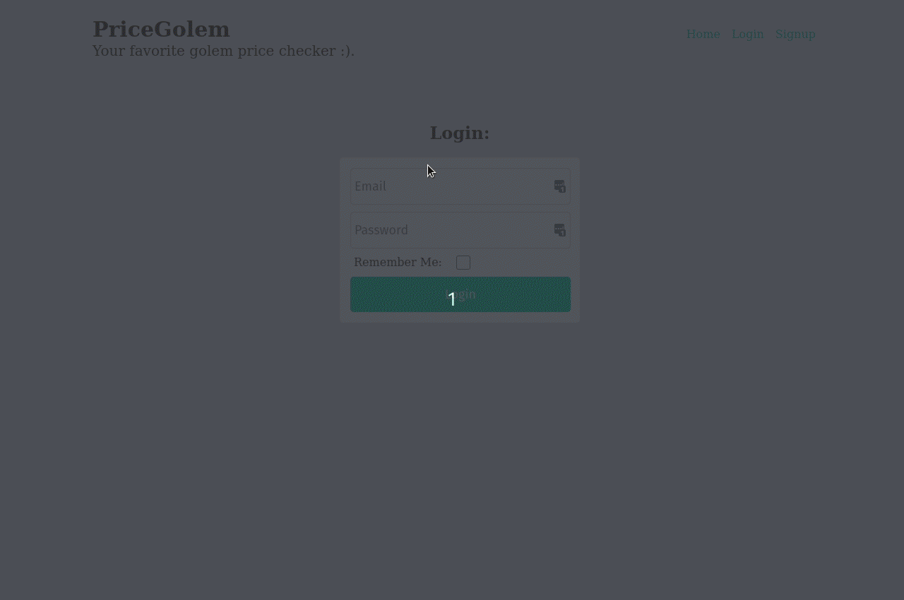

This Flask app tracks the prices of items and sends a text message when the item reaches your desired 'buy price'.



To configure: 

Prerequisites: Python3, pipenv

Create a .env file in the root directory of the project with the following contents:
```
DEBUG=True
FLASK_ENV=development
FLASK_APP=app
DATABASE_URL=sqlite:///db.sqlite3

# Secret Key
SECRET_KEY=makeupyourownsecretkeyhere
```

To configure texting with Twilio add the following to your .env file:
```
# Twilio Keys:
TWILIO_ACCOUNT_SID=your_twilio_sid
TWILIO_AUTH_TOKEN=your_twilio_auth_token
TWILIO_NUMBER=your_twilio_phone_number
```

Be sure to update the above values with your own information from twilio.com

Mac / Linux commands (in order):
```
pipenv install -r requirements.txt
pipenv shell
python3
from app import db
db.create_all()
exit()
flask run
```
The app will now be viewable on localhost:5000

Currently any item URL on bhphotovideo.com or ulta.com can be added along with your desired buy price. 

Support for other sites can be added by modifying Scraper.py and PriceChecker.py.

For texting to work, you will also need to uncomment from PriceChecker.py:
```
#Twilio.send_text(url, selling_price)
```

There is a command you can run from the environment shell 'flask update-prices'. This will update all of your item prices in the DB. You can create a cron job to run that command in the background (from the environment shell) as well. 